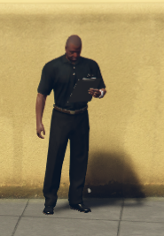
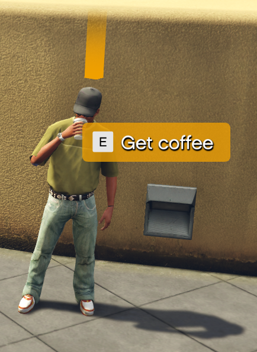
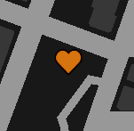
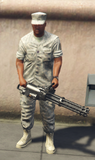

# Quest Giver

This resource, on it's own, does nothing. It's value is in being used by other resources to put NPCs where they need to go.

Interacting with them can run code, trigger events, or just play a voice line. They can say Hi when you approach, and Goodbye when you leave, or be quiet. You can have them do a scenario, or you can have them just stand there like a loser. Your choice.

# How to add NPCs

Since the script doesn't really *do* anything on it's own, adding NPCs directly to `questiver` is not recommended.

## Short version

The absolute minimum an NPC needs is a location, like so:

```lua
exports.questgiver:Add({
    location = vec4(216.689,-891.268,29.692,252.808),
})
```

This will spawn an NPC with the default model and the default scenario, and it will do exactly nothing.  
The use case for this is when you just want some dude to stand next to an existing marker, and you don't want any of the interaction stuff.  It looks like this:



In the example, he is standing in Legion Square, in case you want to go check him out.

## Long version

This is an NPC with a lot of options specified.

```lua
exports.questgiver:Add({
    model = `a_m_m_soucent_03`,
    location = vec4(217.618,-873.862,29.492,295.252),
    scenario = "WORLD_HUMAN_DRINKING",
    greeting = {"GENERIC_HI", "GENERIC_BYE"},
    interact = {
        event = "spork:borrow",
        args = {"one", "two", "three", "four"},
        label = "Get coffee",
        voice = "CHAT_RESP",
        code = function(npcID, ...)
            print(npcID, ...)
        end,
    },
    blip = {
        sprite =  621,
        label = 'Coffee guy',
    },
    marker = {},
    skin = {
        prop = {
            [0] = {  0,  1},
            [1] = {  0,  2},
        },
        var = {
            [0]  = {1, 2, 0},
            [3]  = {1, 2, 0},
            [4]  = {0, 3, 0},
            [10] = {1, 0, 0},
        }
    },
    weapon = `WEAPON_CARBINERIFLE`,
})
```
He looks like this:



He shows up on the map like this:



A few things to note:
- The interaction prompt only appears when you get within range to interact.
- The `marker` has no options at present, but must still be defined a table.
- The `weapon` setting effectively does nothing when a `scenario` non-empty. More on that [later](#the--scenario).

# NPC Definition

I like things organized, so I've organized all the options into tables.  

## General options

These options in the NPCDef type. See also [classes.lua](classes.lua). The options in the class that are not listed here are things handled internally.

| Key      | Type           | Default                 | Purpose |
|----------|----------------|-------------------------|---------|
| blip     | NPCBlip        |                         | NPC map marker. Details below.
| greeting | table          |                         | NPC "hello" and "goodbye" voice lines.
| interact | NPCInteraction |                         | Define what happens when you press E close to the NPC. Details below.
| location | vector4        |                         | **REQUIRED** The location of the NPC. XYZ coordinates, and W for the heading.
| marker   | NPCMarker      |                         | The marker above the NPCs head, if any. Details below.
| model    | hash           | \`s_m_y_doorman_01\`    | The [ped model](https://docs.fivem.net/docs/game-references/ped-models/) for this NPC. Note the backticks! |
| scenario | string         | "WORLD_HUMAN_CLIPBOARD" | The scenario the NPC plays. There are *thousands* of these. A handful are listed in [scenarios.lua](scenarios.lua).
| skin     | table          | randomized              | NPC props and variations.
| weapon   | hash           |                         | The weapon the NPC carries.

## Blip

A "blip" is an icon/marker that appears on the map. If you omit this option, you will just *not* get a blip on the map.

| Key    | Type    | Default | Purpose |
|--------|---------|---------|---------|
| colour | integer | 64      | Specify what [blip colour](https://docs.fivem.net/docs/game-references/blips/#blip-colors) this blip should have. *Note the British spelling!*
| label  | string  |         | Specify what text should appear in the map legend for this blip. If not specified, the default text for the blip will be used by GTA. Specify an empty string, `""`, to *not* appear in the legend at all.
| sprite | integer | 280     | Specify what [blip sprite](https://docs.fivem.net/docs/game-references/blips/) this NPC should be marked with.

## Greeting

Greetings are defined as an array-style table.

For example, a shop keeper might have `{"SHOP_GREET", "SHOP_GOODBYE"}` as their greeting.

The first element is the voice line to play when you come within range, the second one is the line to play when you leave. The NPC greet range is 5 meters.

You can omit the second entry to have it not say anything when you leave, but you can't have only a goodbye.

### Not all peds can say all voice lines!

It is important to note that not all NPCs can say all the voice lines. The best way to find suitable voice lines for your ped is to use some kind of RPF Explorer and open `x64\audio\sfx\S_FULL_SER.rpf` and the surrounding archives.
In there, you will find AWCs named after the peds, which you can then open to see what voice lines they have.

Using the model `s_m_y_doorman_01` as an example, `x64\audio\sfx\S_FULL_SER.rpf` has a listing for `s_m_m_bouncer_01_black_full_01.awc`, which is probably close enough.  
In this AWC, we can find a bunch of audio entries. For example `generic_hi_01`, `generic_hi_02`, `generic_bye_01`, and `generic_bye_02`.

If we give our NPC the greetings of `{"GENERIC_HI", "GENERIC_BYE"}`, then it will randomly select one of the two HI lines, when you approach, and one of the two BYE lines when you leave.

This ped *does not* have `shop_greet_*`, nor `shop_goodbye_*` entries, so the shop keeper example above will *not* work. It won't crash, or anything; The NPC won't say anything at all.

## Intract

| Key     | Type     | Default    | Purpose |
|---------|----------|------------|---------|
| args    | table    |            | The extra arguments to be sent when triggering an event or running a function.
| code    | function |            | The code to run when the interaction happens.
| disable | boolean  | false      | Set if the interaction should be disabled or not.
| event   | string   |            | The event to trigger when the interaction happens.
| label   | string   | "Interact" | The string to show alongside the button prompt. Set to a blank string, `""`, to leave the interaction enabled, *but not have a propmpt*, effectively making it a "secret".
| voice   | string   |            | The voice line to play when the interaction happens.

### Trigger and function arguments

It is important to note that in addition to the arguments listed in `args`, the NPC ID is also sent.  
For example, `args = {"one", "two", "three"}`, on an NPC with the ID of 4, will `TriggerEvent` with the arguments `4, "one", "two", "three"`.  
The same goes for calling the function. `NPCs[4].code(4, "one", "two", "three")`

Recommended handler is something like this:
```lua
AddEventHandler("whatever:your:event:is", function(npcID, ...)
    print(...)
end)
```

If you really don't want this, just re-emit an event more to your liking.

## Location

The location is a simple vector4 value. The NPC will be spawned at the `.xyz` coordinates, and turned to face the `w` heading.

The NPC will be frozen.

Note that setting a scenario can offset the NPC from this position quite far, especially when using the `"AUTO"` scenario.

## Marker

The marker table has only one key:  `hide`

When this is true, the marker will not be drawn. See below for the exported functions, and why this is useful.

*This might get additional features in the future, such as specifying what marker to use, how to scale it, etc.*

## Model

This is just the [ped model](https://docs.fivem.net/docs/game-references/ped-models/) this NPC will have.

Technically you should be fine with just using a string here, but enclosing the model name in \`backticks\` makes it all hashed and ready for later.

The default is `s_m_y_doorman_01`, this guy:  


He has the word "SECURITY" across the back of his shirt.

*Note that the image on the ped models page might not match the actual spawned model, as there can be several variants of each ped. See the [Skin](#skin) section below!*

## Scenario

If you add `@questgiver/scenarios.lua` to your [resource manifest](https://docs.fivem.net/docs/scripting-reference/resource-manifest/resource-manifest/) as a `client_script`, you can refer to scenarios there like `SCENARIO.welding`.

You can also just specify the name, like `"WORLD_HUMAN_WELDING"`.

The default scenario is `SCENARIO.clipboard`, meaning `"WORLD_HUMAN_CLIPBOARD"`, as seen with [the short version](#short-version).

The NPC will look directly at you when the scenario doesn't specify any head movement, so it will look like the NPC is looking at you, and then checking their clipboard. This makes sense for a Quest Giver, which is why it's the default scenario.

There are two *special* values.

### The "AUTO" scenario

On the GTAV map, there are thousands upon thousands of scenario locations, where the NPC peds *do stuff*. They talk on the phone, they use the ATM, they sit in a chair, they eat a burger. All these are map scenarios.  
If you set the [Location](#location) of an NPC within 2.5 meters of such a scenario, you can specify the scenario in your configuration as `SCENARIO.auto` or `"AUTO"`, and `questgiver` will do it's level best to use whatever scenario is there.

[TaskUseNearestScenarioToCoordWarp](https://docs.fivem.net/natives/?_0x58E2E0F23F6B76C3) has some of the details for my fellow nerds.

### The "" scenario

This tells `questgiver` that you don't want the NPC to run a scenario at all. Because you get a default scenario when the value is blank, you have to specifically say you don't want a scenario at all.  
This will cause the NPC to *just stand there*, which can be useful for things like [holding a weapon](#weapon).

## Skin

First of all, you don't *have to* specify a skin. If you don't, the components and props will be *randomized*, by using [SetPedRandomProps](https://docs.fivem.net/natives/?_0xC44AA05345C992C6) and [SetPedRandomComponentVariation](https://docs.fivem.net/natives/?_0xC8A9481A01E63C28).  

**Because `questgiver` NPCs are entirely client-side, this randomization will not be the same for all clients, so the same NPC will look different to different players.**

In order to avoid such discrepencies, you can set the NPCs *skin*.

To understand the *format* of the skin section, we have to look at two native functions in GTAV, [SetPedPropIndex](https://docs.fivem.net/natives/?_0x93376B65A266EB5F) and [SetPedComponentVariation](https://docs.fivem.net/natives/?_0x262B14F48D29DE80).

The skin format is essentially just a map of what arguments to call those functions with.

### Prop index

[SetPedPropIndex](https://docs.fivem.net/natives/?_0x93376B65A266EB5F) sets which prop, such as sunglasses or a utility belt, you want to add to a ped.

* There are 14 *anchor points*, each with their own ID, from 0 to 13.
* Each anchor point has a number of drawables, each with their own *drawable ID*.
* Each drawable has a number of textures, each with their own *texture ID*.

```lua
skin = {
    prop = {
        [0] = { 0, 1}, -- Sets prop at anchor zero (head/hat) to drawable 0, with texture 1.
    }
}
```

*Note that setting any prop drawable to -1 will cause `questgiver` to [actively remove](https://docs.fivem.net/natives/?_0x0943E5B8E078E76E) any prop in that slot, in case there is a default one you want to get rid of, or whatever.*

### Component variation

[SetPedComponentVariation](https://docs.fivem.net/natives/?_0x262B14F48D29DE80) sets which variation you want for a given component.

* There are 12 *component IDs*, from 0 to 11.  
* Each component has a certain number of drawables, each with their own *drawable ID*.  
* Each drawable has a certain number of textures, each wtith their own *texture ID*.
* Each texture can be drawn with 4 different palettes, each with their own *palette ID*, from 0 to 3

```lua
skin = {
    var = {
        [0] = {1, 2, 0} -- Sets component zero (head) to drawable 1, with texture 2, palette 0
    }
}
```

## Weapon

You can have your NPC hold a weapon, if you like.  For example, you can do this:

```lua
exports.questgiver:Add({
    location = vec4(217.212,-867.119,29.492,249.065),
    model = `s_m_y_marine_01`,
    scenario = "",
    weapon = `WEAPON_MINIGUN`,
})
```

This looks like so:  


*Note that the [scenario](#scenario) has been disabled here, as most scenarios come with a prop or motion that hides any weapons the ped might have.*

# Exported functions

Exported functions are the main

## Add

Adds an NPC.

```lua
local npcID = exports.questgiver:Add(npcDefinition)
```

* `npcDefinition` is any valid table of NPC definition data, as outlined in [NPC Definition](#npc-definition).

Returns an NPC ID for the added NPC.

## Enable

Pretains to the whole NPC. Disabled NPCs don't show up and can't be interacted with.

```lua
local isEnabled = exports.questgiver:Enable(npcID, state)
```

* `npcID` is any valid NPC ID, as returned by [Add](#add).
* `state` is ither `true`, if you want this NPC to be enabled, or `false` if you want it disabled.

Returns the state *after* setting it, or `nil` if the given NPC ID is invalid.

## IsEnabled

Pretains to the whole NPC. Disabled NPCs don't show up and can't be interacted with.

```lua
local isEnabled = exports.questgiver:IsEnabled(npcID)
```

* `npcID` is any valid NPC ID, as returned by [Add](#add).  

Returns the enabled state of the given NPC. `true` if it is enabled and will spawn when in range, `false` if it is disabled, or `nil` if the NPC ID is invalid.


## GetPed

Pretains to the actual spawned entity, if any.

```lua
exports.questgiver:GetPed(npcID)
```

* `npcID` is any valid NPC ID, as returned by [Add](#add).

Returns the entity ID of the ped associated with the given NPC, if spawned. Returns `nil` if the NPC ID is invalid, or no ped is spawned.  
If you are too far away, it will not be spawned, and is not obtainable.

## HideMarker

Pretains to the floating symbol above the NPCs head.

```lua
local isHidden = exports.questgiver:HideMarker(npcID, setting)
```

* `npcID` is any valid NPC ID, as returned by [Add](#add).
* `setting` is `true` to hide the marker, `false` to show it, or `nil` to toggle visibility.

Returns the hiddenness of the marker as a boolean value, or `nil` if the NPC ID is invalid, or it has no marker.

## HasMarker

Pretains to the floating symbol above the NPCs head.

```lua
local hasMarker = exports.questgiver:HasMarker(npcID)
```

* `npcID` is any valid NPC ID, as returned by [Add](#add).

Returns `nil` if the NPC ID is invalid, or it has no marker defined, `true` if the marker is visible, and `false` if it is hidden.

## DisableInteraction

Pretains to the `[E] Interact`-style prompt.

```lua
local isDisabled = exports.questgiver:DisableInteraction(npcID, setting)
```

* `npcID` is any valid NPC ID, as returned by [Add](#add).
* `setting` is `true` to disable NPC interaction, `false` to enable it.  `nil` to toggle.

Returns `nil` if the NPC ID is invalid, or it has no interaction specified. `true` if the interaction was disabled, `false` if it was enabled.

## IsInteractable

Pretains to the `[E] Interact`-style prompt.

```lua
exports.questgiver:IsInteractable(npcID)
```

* `npcID` is any valid NPC ID, as returned by [Add](#add).

Returns `nil` if the NPC ID is invalid, or the NPC has no interaction specified. `true` if interactions are enabled, `false` if they are disabled.

# Events

There are a couple of events, but they're not very useful.

Check out [cl_questgiver_events.lua](cl_questgiver_events.lua) if you want to see them.  
They are not supported in any way, and **can be removed without notice in future versions.**

# Convar configuration

Convars, or Console Variables, are settings you can make in your server.cfg, or set from your console.

It is recommended to set these as [Server Replicated Convars](https://docs.fivem.net/docs/scripting-reference/convars/#server-replicated-convars)

Each convar is shown here with it's default value. Add these to your server configuration to override.  Before or after starting the resource doesn't matter, as they are all client-side anyway.

You don't *have to* set any of these, but if you're making resources using `questgiver`, you should be mindful of their existence.

## questgiverPrompt

String: `setr questgiverPrompt "~INPUT_CONTEXT~ ~a~"`

Sets the template for the intraction prompt shown when you are close to an interactable NPC.

## questgiverColour

Integer: `setr questgiverColour 64`

Sets the [HUD colour](https://docs.fivem.net/docs/game-references/hud-colors/) for things like the interaction prompt and the marker.

*Note the British spelling!*

## questgiverDefaultScenario

String: `setr questgiverDefaultScenario "WORLD_HUMAN_CLIPBOARD"`

Sets the default scenario an NPC will perform if no other scenario is specified.

## questgiverDefaultModel

Integer: `setr questgiverDefaultModel 579932932`

Sets the default model for quest givers.  Default is GetHashKey('s_m_y_doorman_01')
